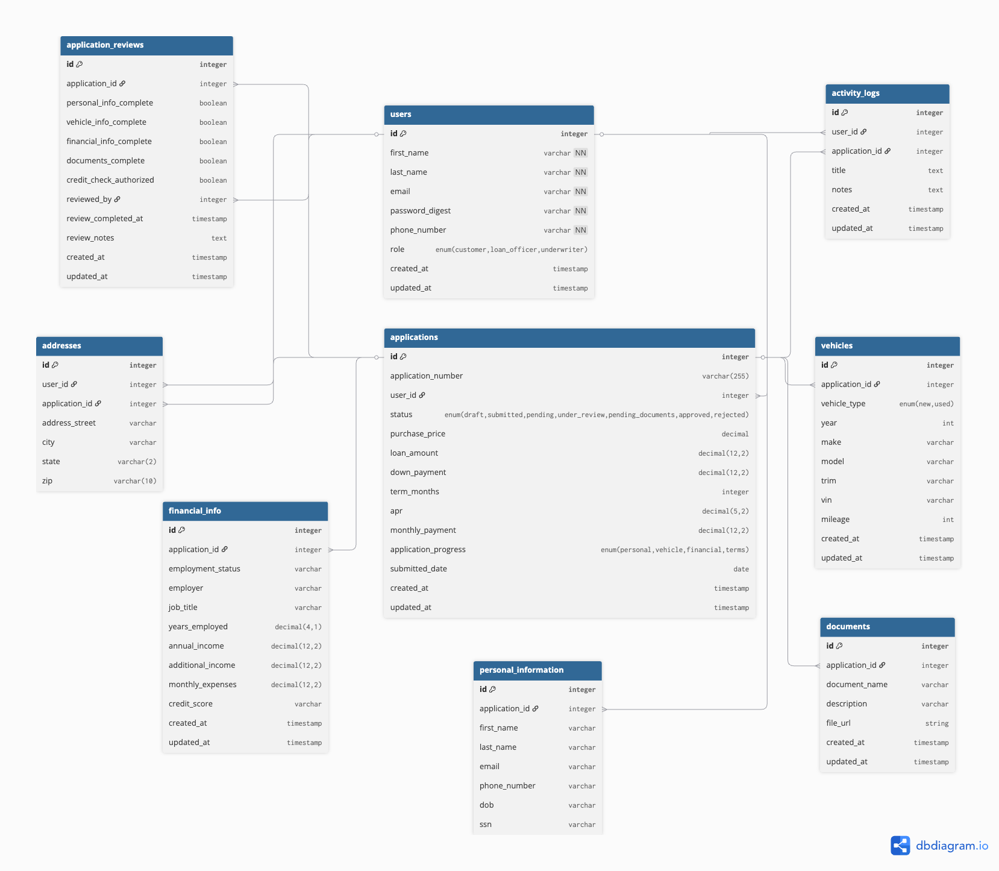

# TurboLoan

*by One Ruby Studio*

## Description

A full-stack auto loan application system that allows customers to apply for vehicle loans, loan officers to review and assess applications, and underwriters to make final lending decisions. The platform streamlines the entire loan lifecycle — from application submission through approval or rejection — with role-based dashboards, real-time progress tracking, and document management.

## Key Features

- **Customer Portal** — Multi-step loan application with auto-save, document upload, and application tracking
- **Loan Officer Dashboard** — Searchable and sortable application queue with server-side filtering, completeness checklists, and eligibility assessments
- **Underwriter Review** — Final decision workflow for approving, rejecting, or returning applications
- **Role-Based Access Control** — Separate dashboards and permissions for customers and loan officers.
- **Real-Time Application Status** — Track applications through draft, submitted, under review, approved, and rejected stages
- **Secure Authentication** — JWT-based authentication with Devise for session management
- **RESTful API** — Full API documentation via Swagger UI

## Technology

| Layer | Stack |
|-------|-------|
| **Frontend** | React, Vite, Tailwind CSS, Zustand, React Hook Form, React Router |
| **Backend** | Ruby on Rails 8, PostgreSQL, Devise, Devise-JWT |
| **Testing** | Jest, React Testing Library, RSpec, FactoryBot, Shoulda Matchers |
| **API Docs** | Swagger / Rswag |
| **Dev Tools** | Foreman, dotenv-rails, ESLint, Prettier |
| **Project Management** | Jira, Slack
| **Design & Planning** | Figma, Miro (Wireframes), ER Diagrams

## Team Members

| Name | Role |
|------|------|
| [Shuveksha Tuladhar](https://github.com/shuveksha-tuladhar) | Full Stack Developer |
| [Vera Fesianava](https://github.com/verafes) | Full Stack Developer |
| [Elena Bychenkova](https://github.com/ElenaByc) | Full Stack Developer |
| [Thanh Phong Le](https://github.com/ltphongssvn) | Full Stack Developer |
| [Valery Lyzhyn](https://github.com/sheper96) | Full Stack Developer |

## Mentors

| Name | Role |
|------|------|
| [Diana Liao](https://github.com/DianaLiao) | Lead & Technical Mentor |
| [Gabriel Halley](https://github.com/ghalley) | Technical Mentor |

---

## Database Models & Associations

### Entity Relationship Diagram



### Models

| Model | Key Associations | Description |
|-------|-----------------|-------------|
| **User** | has_many :applications | Customer, loan officer, or underwriter. Authenticates via Devise + JWT. |
| **Application** | belongs_to :user, has_one :vehicle, :personal_info, :financial_info, :application_review, has_many :addresses, :documents | Core loan application with status tracking, auto-generated application number, and monthly payment calculation. |
| **PersonalInfo** | belongs_to :application | Applicant's name, email, phone, DOB, and SSN. Validates age ≥ 18. |
| **Vehicle** | belongs_to :application | Vehicle details — year, make, model, VIN, mileage, and condition (new / certified_used / used). |
| **Address** | belongs_to :application | Street address with validated US state abbreviation and zip code. |
| **FinancialInfo** | belongs_to :application | Employment details, income, expenses, and self-reported credit score (excellent / good / fair / poor). |
| **ApplicationReview** | belongs_to :application, belongs_to :reviewer (User) | Loan officer review checklist and notes. Tracks completeness of each section. |
| **Document** | belongs_to :application | Uploaded document metadata (name, type). |

### Enums

| Model | Enum | Values |
|-------|------|--------|
| User | `role` | customer, loan_officer, underwriter |
| Application | `status` | draft, submitted, pending, under_review, pending_documents, approved, rejected |
| Application | `application_progress` | personal, vehicle, financial, terms, review |
| Vehicle | `vehicle_type` | new, certified_used, used |
| FinancialInfo | `credit_score` | excellent, good, fair, poor |

---


## Environment Setup

This project uses environment files to configure Rails and React communication.

### Step 1: Copy Environment File
```bash
cp .env.development.local.example .env.development.local
```

### Step 2: Edit Your Local Settings

Edit `.env.development.local` with your values:
- `DATABASE_URL` - Your local PostgreSQL connection string
- `DEVISE_JWT_SECRET_KEY` - JWT secret (minimum 32 characters)
- `VITE_API_URL` - Rails backend URL (default: http://localhost:3000)
- `FRONTEND_URL` - React frontend URL (default: http://localhost:5173)

### Step 3: Enable Rails to Read .env Files

Rails does not read `.env` files by default. Choose ONE option:

#### Option 1: Add dotenv-rails Gem (Simpler)

Add to `backend/Gemfile`:
```ruby
gem 'dotenv-rails', groups: [:development, :test]
```

Then run:
```bash
cd backend && bundle install
```

Now you can start Rails directly:
```bash
cd backend && rails s
```

#### Option 2: Use Foreman 

Add `foreman` gem to `backend/Gemfile`:
```ruby
group :development do
  gem 'foreman'
end
```

Create `Procfile.dev` at project root:
```
backend: cd backend && rails s -p 3000
frontend: cd frontend && npm run dev
```

Create `bin/dev` at project root:
```bash
#!/usr/bin/env bash
exec foreman start -f Procfile.dev -e .env.development.local
```

Make it executable and run:
```bash
chmod +x bin/dev
./bin/dev
```

Foreman auto-loads `.env.development.local` before starting Rails.

### Environment Files Reference

| File | Purpose | Committed |
|------|---------|-----------|
| `.env.development.local.example` | Template for local dev | Yes |
| `.env.development.local` | Your local settings | No (gitignored) |

### How Environment Variables Are Used

| Key | Used By | Location |
|-----|---------|----------|
| `DATABASE_URL` | Rails | `config/database.yml` |
| `DEVISE_JWT_SECRET_KEY` | Rails | `config/initializers/devise_jwt.rb` |
| `VITE_API_URL` | Vite/React | `frontend/src/services/api.ts` |
| `FRONTEND_URL` | Rails CORS | `config/initializers/cors.rb` |

**Note:** Never commit files containing actual secrets. Only `.env*.example` files should be committed.

## Database Setup & Seeds

1. **Create and migrate the database**
```bash 
cd backend
rails db:create
rails db:migrate 
```

2. **Seed default users**
```bash
rails db:seed
```

Or using Bundler:
```bash
bundle exec rails db:seed
```

3. **Verify seeded data**
```bash
bundle exec rails console
User.where(role: [:loan_officer, :underwriter]).pluck(:email, :role)
```
Note: Seeds are safe to re-run — `find_or_initialize_by` is used, so duplicates are avoided.

4. **Reset and reseed database (if needed)**
```bash
bundle exec rails db:drop db:create db:migrate db:seed
```

## API Documentation 

### Quick Start with Authentication
1. **Register a new user**: `POST /signup`
2. **Login to get token**: `POST /login`
3. **Use the token**: Add `Authorization: Bearer <token>` header to all protected requests

### Available Endpoints

#### Authentication
| Method | Endpoint | Description | Auth |
|--------|----------|-------------|------|
| POST | `/signup` | Register a new user | No |
| POST | `/login` | Login and receive JWT token | No |
| DELETE | `/logout` | Logout and invalidate token | Yes |

#### Users
| Method | Endpoint | Description | Auth |
|--------|----------|-------------|------|
| GET | `/api/v1/me` | Get current user profile | Yes |
| GET | `/api/v1/users` | List all users (loan officer / underwriter only) | Yes |
| GET | `/api/v1/users/:id` | Get specific user | Yes |
| PATCH | `/api/v1/users/:id` | Update user profile | Yes |
| DELETE | `/api/v1/users/:id` | Delete user (loan officer / underwriter only) | Yes |

#### Applications
| Method | Endpoint | Description | Auth |
|--------|----------|-------------|------|
| POST | `/api/v1/applications` | Create a new loan application | Yes |
| GET | `/api/v1/applications` | List applications (scoped by role, paginated) | Yes |
| GET | `/api/v1/applications/:id` | Get full application details | Yes |
| PATCH | `/api/v1/applications/:id` | Update a draft application | Yes |

**Query params for `GET /api/v1/applications`** (loan officer / underwriter):

| Param | Type | Description |
|-------|------|-------------|
| `page` | integer | Page number (default: 1, 20 per page) |
| `status` | string | Filter by status (`submitted`, `pending`, `under_review`, etc.) |
| `applicant_name` | string | Search by applicant first or last name |
| `application_number` | string | Search by application number |
| `sort_by` | string | Sort column: `application_number`, `status`, `submitted_date`, `created_at` |
| `sort_order` | string | `asc` or `desc` (default: `desc`) |

#### Application Review
| Method | Endpoint | Description | Auth |
|--------|----------|-------------|------|
| PATCH | `/api/v1/applications/:application_id/review` | Update review checklist and notes (loan officer / underwriter only) | Yes |

### Testing with Swagger UI
Visit **[http://localhost:3000/api-docs](http://localhost:3000/api-docs)** to:
- Browse all available endpoints
- Try API calls directly from your browser
- View request/response schemas
